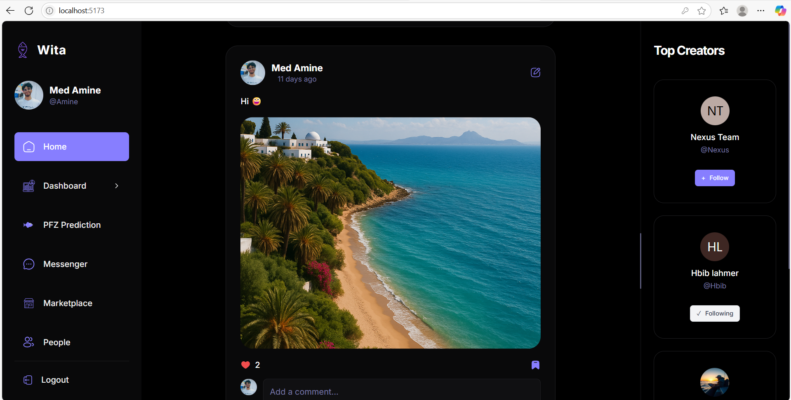
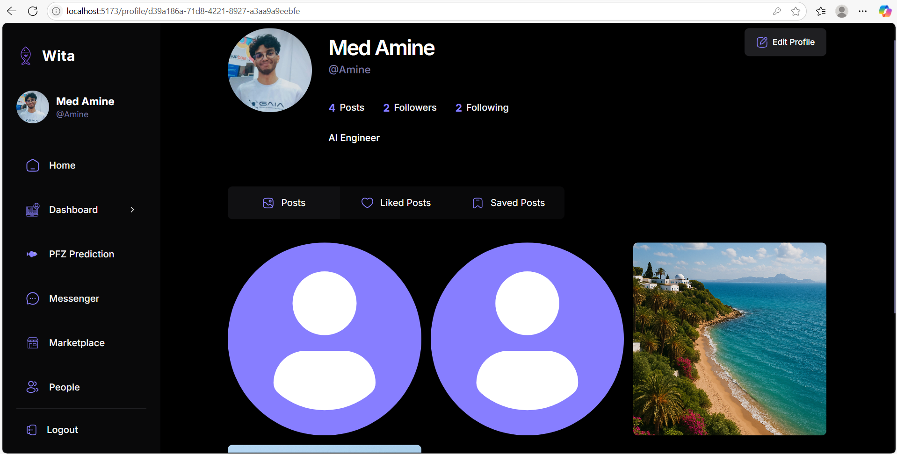
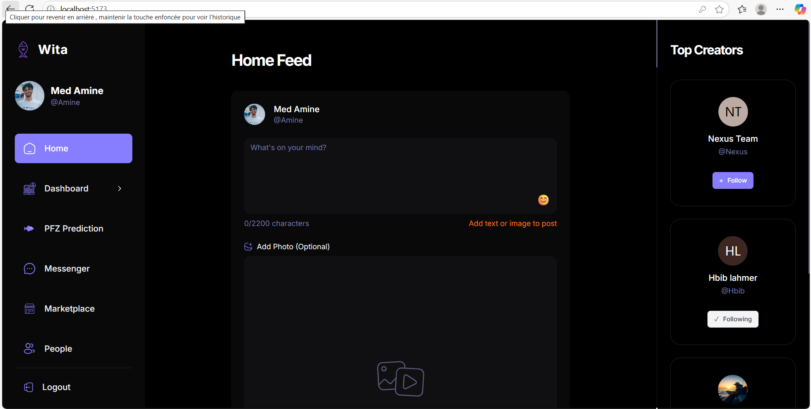
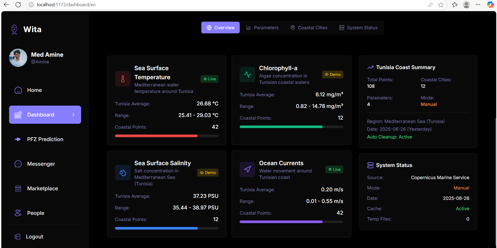
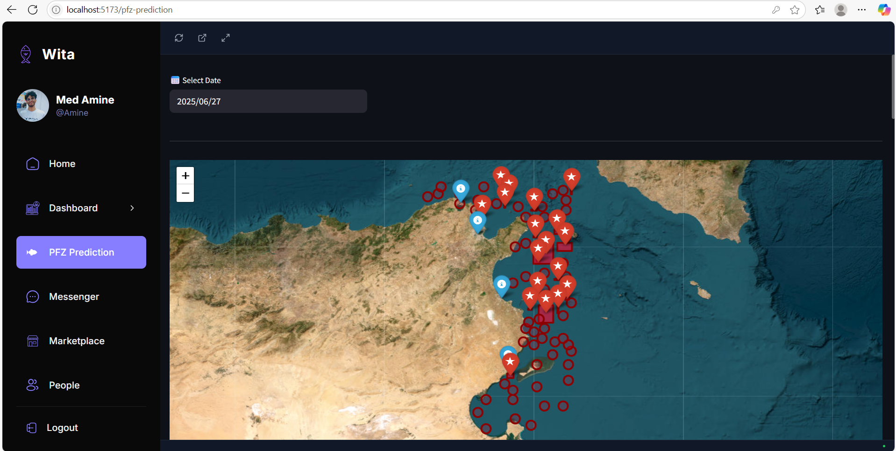

# 🌊 Wita - Marine Ecosystem and Social Platform

<div align="center">


**Wita** is a comprehensive full-stack web application that combines social media features with advanced marine ecosystem monitoring and prediction capabilities. The platform integrates real-time IoT data, satellite Earth Observation (EO) analysis, machine learning predictions for Potential Fishing Zones (PFZ), and a vibrant community marketplace.

[](https://opensource.org/licenses/MIT)
[](https://nodejs.org/)
[](https://python.org/)
[](https://reactjs.org/)
[](https://typescriptlang.org/)

</div>

---

## 📋 Table of Contents

- [🌊 Project Overview](#-project-overview)
- [📁 Module Documentation](#-module-documentation)
- [🛠️ Technology Stack](#%EF%B8%8F-technology-stack)
- [🏗️ Project Architecture](#%EF%B8%8F-project-architecture)
- [🚀 Quick Start](#-quick-start)
- [🔧 Detailed Setup](#-detailed-setup)
- [� Key Features](#-key-features)
- [📱 Usage Guide](#-usage-guide)
- [🧪 Development](#-development)
- [🚧 Troubleshooting](#-troubleshooting)
- [🤝 Contributing](#-contributing)

---

## �🌊 Project Overview

Wita serves as a digital ecosystem for marine professionals, researchers, and fishing communities by providing:

- **🌐 Social Platform**: Modern social media interface with posts, messaging, and community features
- **📊 IoT Dashboard**: Real-time monitoring of marine sensors and environmental data
- **🛰️ Earth Observation Dashboard**: Satellite data analysis and visualization for water quality assessment
- **🎯 PFZ Prediction**: Machine learning-powered predictions for optimal fishing zones
- **🛒 Community Marketplace**: Platform for buying/selling fishing-related equipment and services
- **💬 Interactive Messaging**: Real-time communication between community members

---

## �️ Interface Screenshots

Experience the power and elegance of Wita through our comprehensive user interface designed for marine professionals, researchers, and fishing communities.

### 🌐 Social Media Platform

<div align="center">

#### Home Feed & Social Interactions

*Dynamic social feed with infinite scroll, post interactions, and community engagement*

#### User Profiles & Content Discovery
 
*Customizable user profiles with follower systems and content discovery features*

#### Post Creation & Management
 
*Rich media post creation with image upload and detailed post management*

</div>

### 📊 IoT Dashboard & Real-time Monitoring

<div align="center">


#### Environmental Monitoring

*Real-time environmental condition tracking with alerts and historical trends*

#### Sensor Data Visualization

*Live sensor readings including temperature, pH, and water quality metrics*

#### Thermal Imaging System

*Advanced thermal sensor visualization with 8x8 thermal arrays and heatmap generation*

</div>

### 🎯 Machine Learning & PFZ Predictions

<div align="center">

#### PFZ Prediction Interface

*Interactive machine learning interface for Potential Fishing Zone predictions*


</div>

### 🔐 Authentication & User Management

<div align="center">

#### Login System

*Secure authentication with Supabase integration and form validation*

#### User Registration

*Comprehensive user registration with profile creation and email verification*

</div>

### 📱 Additional Features

<div align="center">

#### User Directory

*Community user directory with search and filtering capabilities*


#### User Settings

*Comprehensive user profile management and settings configuration*

</div>

### 🎨 Design Highlights

- **🌊 Marine Theme**: Ocean-inspired color palette with deep blues and marine aesthetics
- **📱 Responsive Design**: Mobile-first approach ensuring perfect functionality across all devices
- **⚡ Performance Optimized**: Fast loading times with optimized images and lazy loading
- **♿ Accessibility**: WCAG compliant design with proper contrast ratios and keyboard navigation
- **🎯 Intuitive UX**: Clean, modern interface designed for ease of use by marine professionals

---

## �📁 Module Documentation

### Frontend Application
📂 **[Frontend (React App)](./social_media_app/README.md)**
- User interface and client-side logic
- React, TypeScript, TailwindCSS
- Authentication, social features, dashboards

### Backend Services
📂 **[Backend APIs (Flask)](./social_media_app/Backend/README.md)**
- REST API services
- Ocean data processing
- IoT sensor integration

📂 **[ML/AI Services (Streamlit)](./pfz-prediction-app/README.md)**
- PFZ prediction models
- Geospatial analysis
- Machine learning algorithms

### Core Components
📂 **[Authentication System](./social_media_app/src/_auth/README.md)**
- User registration and login
- Password reset functionality  
- Session management and security

📂 **[UI Components](./social_media_app/src/components/README.md)**
- Reusable React components
- Design system and theming
- Form components and validation

📂 **[Application Pages](./social_media_app/src/_root/pages/README.md)**
- Main application pages
- User flows and navigation
- Social features and content management

📂 **[Dashboard Systems](./social_media_app/src/_root/pages/dashboards/README.md)** *(Planned)*
- IoT sensor monitoring
- Earth observation data
- Real-time analytics

📂 **[Marketplace Module](./social_media_app/src/components/marketplace/README.md)** *(Planned)*
- Item listings and search
- Transaction management
- User communications

📂 **[Messaging System](./social_media_app/src/components/messaging/README.md)** *(Planned)*
- Real-time chat
- File sharing
- Notification system

## 🛠️ Technology Stack

### Frontend
- **React 18** with TypeScript for robust component architecture
- **Vite** for fast development and optimized builds
- **React Router DOM** for client-side routing
- **TailwindCSS** with custom styling for modern UI design
- **Radix UI** components for accessible design patterns
- **React Query (TanStack Query)** for efficient data fetching and caching
- **React Hook Form** with Zod validation for form management
- **Leaflet & React Leaflet** for interactive maps and geospatial visualization
- **Recharts** for data visualization and dashboard charts
- **Supabase** for authentication and real-time database

### Backend & Data Processing
- **Streamlit** application for PFZ prediction modeling
- **Python** with scientific computing libraries:
  - **Pandas & NumPy** for data processing
  - **Scikit-learn** for machine learning models
  - **GeoPandas & Shapely** for geospatial data processing
  - **Folium** for geographic data visualization
  - **Joblib** for model serialization

### Machine Learning & Geospatial
- **Random Forest** model for PFZ predictions
- **DBSCAN** clustering for spatial analysis
- **Tunisia coastline shapefile** integration
- **Sea Surface Temperature (SST)** analysis
- **Satellite Earth Observation** data processing

### Database & Authentication
- **Supabase** PostgreSQL database
- **Row Level Security (RLS)** for data protection
- **OAuth** authentication system
- **Real-time subscriptions** for live updates

## 🏗️ Project Structure

```
Nexus/
├── social_media_app/                 # Frontend React Application
│   ├── src/
│   │   ├── _auth/                   # Authentication components
│   │   │   ├── AuthLayout.tsx       # Auth layout wrapper
│   │   │   └── forms/               # Login/signup forms
│   │   ├── _root/                   # Protected routes
│   │   │   ├── RootLayout.tsx       # Main app layout
│   │   │   └── pages/               # Application pages
│   │   │       ├── Home.tsx         # Social feed
│   │   │       ├── Dashboard/       # IoT & EO dashboards
│   │   │       ├── PFZPrediction.tsx # ML predictions interface
│   │   │       ├── Marketplace.tsx  # Community marketplace
│   │   │       ├── Messenger.tsx    # Real-time messaging
│   │   │       └── Profile.tsx      # User profiles
│   │   ├── components/
│   │   │   ├── shared/              # Reusable components
│   │   │   └── ui/                  # UI primitives
│   │   ├── lib/
│   │   │   ├── appwrite/           # Legacy API connections
│   │   │   ├── react-query/        # Data fetching hooks
│   │   │   └── validation/         # Form validation schemas
│   │   ├── context/                # React context providers
│   │   ├── hooks/                  # Custom React hooks
│   │   └── types/                  # TypeScript definitions
│   ├── public/assets/              # Static assets and icons
│   ├── package.json                # Dependencies and scripts
│   ├── tailwind.config.js          # TailwindCSS configuration
│   ├── vite.config.ts             # Vite build configuration
│   └── tsconfig.json              # TypeScript configuration
│
└── pfz-prediction-app/             # Backend ML Application
    ├── models/                     # Trained ML models
    │   └── random_forest_model.joblib
    ├── shp_extraction/            # Geographic shapefiles
    │   └── 3qtek_TUN_0.shp       # Tunisia coastline data
    ├── assets/                    # Static resources
    ├── config/                    # Configuration files
    ├── utils/                     # Utility functions
    ├── pfz_env_new/              # Python virtual environment
    └── rf.py                     # Main Streamlit application
```

## 🚀 Key Features

### 🌐 Social Media Platform
- **Post Creation & Sharing**: Rich media posts with image upload
- **Social Interactions**: Like, save, comment, and share functionality
- **User Profiles**: Customizable profiles with follower/following system
- **Real-time Feed**: Dynamic home feed with infinite scroll
- **Content Discovery**: Explore page with search and filtering

### 📊 Dashboard Systems
- **IoT Dashboard**: Real-time sensor data visualization
  - Water temperature, salinity, and pH monitoring
  - GPS tracking of marine vessels
  - Environmental condition alerts
  
- **Earth Observation Dashboard**: Satellite data analysis
  - Water quality assessment
  - Chlorophyll concentration mapping
  - Sea surface temperature trends
  - Environmental change detection

### 🎯 PFZ Prediction System
- **Machine Learning Integration**: Random Forest model for fishing zone prediction
- **Environmental Data Processing**: SST, bathymetry, and seasonal analysis
- **Interactive Maps**: Leaflet-based visualization of predicted zones
- **Historical Analysis**: Temporal pattern recognition
- **Customizable Parameters**: User-defined search criteria

### 🛒 Community Marketplace
- **Item Listings**: Equipment, boats, and service offerings
- **Advanced Search**: Category-based filtering and location search
- **User Messaging**: Direct communication between buyers/sellers
- **Image Gallery**: Multi-image product displays
- **Condition Tracking**: Item condition and availability status

### 💬 Real-time Messaging
- **Direct Messages**: One-on-one communication
- **Emoji Support**: Rich text messaging with emoji picker
- **File Sharing**: Document and image attachments
- **Online Status**: User presence indicators
- **Message History**: Persistent conversation storage

## 🔧 Setup Instructions

### Prerequisites
- **Node.js** 18+ and npm/yarn
- **Python** 3.8+ with pip
- **Git** for version control

### Frontend Setup

1. **Clone the repository**:
   ```bash
   git clone <repository-url>
   cd Nexus/social_media_app
   ```

2. **Install dependencies**:
   ```bash
   npm install
   # or
   yarn install
   ```

3. **Environment Configuration**:
   Create `.env.local` file in the root directory:
   ```env
   VITE_SUPABASE_URL=your_supabase_project_url
   VITE_SUPABASE_ANON_KEY=your_supabase_anon_key
   VITE_API_BASE_URL=http://localhost:8501
   ```

4. **Start development server**:
   ```bash
   npm run dev
   # or
   yarn dev
   ```

   The application will be available at `http://localhost:5173`

### Backend Setup

1. **Navigate to backend directory**:
   ```bash
   cd ../pfz-prediction-app
   ```

2. **Create and activate virtual environment**:
   ```bash
   # Windows
   python -m venv pfz_env_new
   pfz_env_new\Scripts\activate

   # macOS/Linux
   python3 -m venv pfz_env_new
   source pfz_env_new/bin/activate
   ```

3. **Install Python dependencies**:
   ```bash
   pip install streamlit pandas numpy scikit-learn geopandas folium joblib shapely
   ```

4. **Install additional geospatial libraries**:
   ```bash
   pip install streamlit-folium pyproj fiona
   ```

5. **Run the Streamlit application**:
   ```bash
   streamlit run rf.py
   ```

   The ML prediction interface will be available at `http://localhost:8501`

### Database Setup (Supabase)

1. **Create a Supabase project** at [supabase.com](https://supabase.com)

2. **Set up authentication**:
   - Enable email/password authentication
   - Configure OAuth providers if needed
   - Set up password recovery

3. **Create database tables**:
   ```sql
   -- Users table (auto-created by Supabase Auth)
   -- Posts table
   CREATE TABLE posts (
     id UUID DEFAULT gen_random_uuid() PRIMARY KEY,
     creator TEXT REFERENCES auth.users(id) ON DELETE CASCADE,
     caption TEXT,
     image_url TEXT,
     image_id TEXT,
     location TEXT,
     tags TEXT[],
     likes TEXT[],
     created_at TIMESTAMP WITH TIME ZONE DEFAULT NOW(),
     updated_at TIMESTAMP WITH TIME ZONE DEFAULT NOW()
   );

   -- Additional tables for marketplace, comments, etc.
   ```

4. **Configure Row Level Security (RLS)**:
   - Enable RLS on all tables
   - Create appropriate policies for data access

## 🔐 Environment Variables

### Frontend (.env.local)
```env
VITE_SUPABASE_URL=your_supabase_project_url
VITE_SUPABASE_ANON_KEY=your_supabase_anon_key
VITE_API_BASE_URL=http://localhost:8501
VITE_APP_TITLE=Wita
```

### Backend Configuration
The backend uses environment-specific configurations in the `Config` class within `rf.py`. Modify the following constants as needed:

```python
class Config:
    MODEL_PATH = "models/random_forest_model.joblib"
    SCALER_PATH = "models/scaler.joblib"  
    TUNISIA_SHAPEFILE = "shp_extraction/3qtek_TUN_0.shp"
    LAT_MIN, LAT_MAX = 33.0, 37.5
    LON_MIN, LON_MAX = 8.0, 12.0
    RESOLUTION = 0.05
```

## 📱 Usage Guide

### For Marine Professionals
1. **Dashboard Monitoring**: Access real-time IoT and EO dashboards
2. **PFZ Predictions**: Use ML predictions for fishing zone optimization
3. **Community Networking**: Connect with other professionals
4. **Equipment Trading**: Buy/sell equipment through marketplace

### For Researchers  
1. **Data Analysis**: Access historical environmental data
2. **Collaboration**: Share findings through posts and messaging
3. **Trend Monitoring**: Track environmental changes over time

### For Fishing Communities
1. **Zone Predictions**: Get optimal fishing location recommendations
2. **Weather Updates**: Monitor environmental conditions
3. **Community Trading**: Access local marketplace
4. **Knowledge Sharing**: Exchange experiences and tips

## 🧪 Development

### Available Scripts

**Frontend**:
- `npm run dev` - Start development server
- `npm run build` - Build for production  
- `npm run preview` - Preview production build
- `npm run lint` - Run ESLint

**Backend**:
- `streamlit run rf.py` - Start ML prediction server
- `python -m pytest` - Run tests (if implemented)

### Project Architecture

The application follows a modular architecture:

- **Component-based UI**: Reusable React components with TypeScript
- **Custom Hooks**: Shared logic through React hooks
- **Context Providers**: State management for authentication and global data
- **API Layer**: Centralized API calls with React Query
- **Type Safety**: Comprehensive TypeScript coverage
- **Responsive Design**: Mobile-first TailwindCSS implementation

## 🛡️ Security Features

- **Row Level Security**: Database-level access control
- **Authentication Guards**: Protected routes and components
- **Input Validation**: Zod schema validation for all forms
- **CORS Configuration**: Secure cross-origin requests
- **Environment Isolation**: Separate configs for dev/prod

## 🚧 Known Issues & Troubleshooting

### Common Frontend Issues
1. **React Router Redirects**: Tab switching may cause redirects to "/" - check `AuthContext.tsx` for session handling
2. **Image Loading**: Fallback to placeholder images on load errors
3. **Mobile Responsiveness**: Test on various screen sizes

### Backend Issues
1. **Model Loading**: Ensure `random_forest_model.joblib` exists in the models directory
2. **Geospatial Dependencies**: May require system-level GDAL installation
3. **Memory Usage**: Large datasets may require increased memory allocation

### Environment Issues
- **Python Dependencies**: Use virtual environment to avoid conflicts
- **Node Version**: Ensure compatibility with Node.js 18+
- **Database Connections**: Verify Supabase configuration and network access

## 🔮 Future Enhancements

- **Mobile Application**: React Native implementation
- **Advanced Analytics**: Enhanced data visualization and reporting
- **AI Integration**: Additional ML models for environmental prediction
- **Multi-language Support**: Internationalization (i18n)
- **Offline Capabilities**: Progressive Web App (PWA) features
- **Integration APIs**: Third-party weather and marine data services

## 🤝 Contributing

1. Fork the repository
2. Create a feature branch: `git checkout -b feature-name`
3. Commit changes: `git commit -m 'Add feature'`
4. Push to branch: `git push origin feature-name`  
5. Submit a pull request

## 📄 License

This project is licensed under the MIT License - see the LICENSE file for details.

## 🙏 Acknowledgments

- **Supabase** for backend infrastructure
- **Vite** for build tooling
- **TailwindCSS** for styling framework
- **React Community** for excellent documentation and ecosystem
- **Open Source GIS** community for geospatial tools

---

**Built with ❤️ for the marine community**

For questions, issues, or contributions, please open an issue on GitHub or contact the development team.
