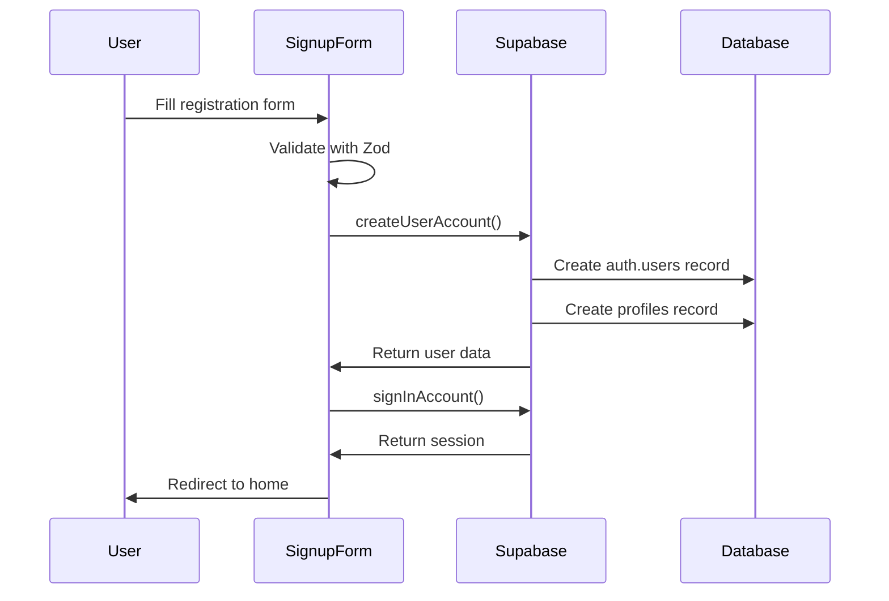
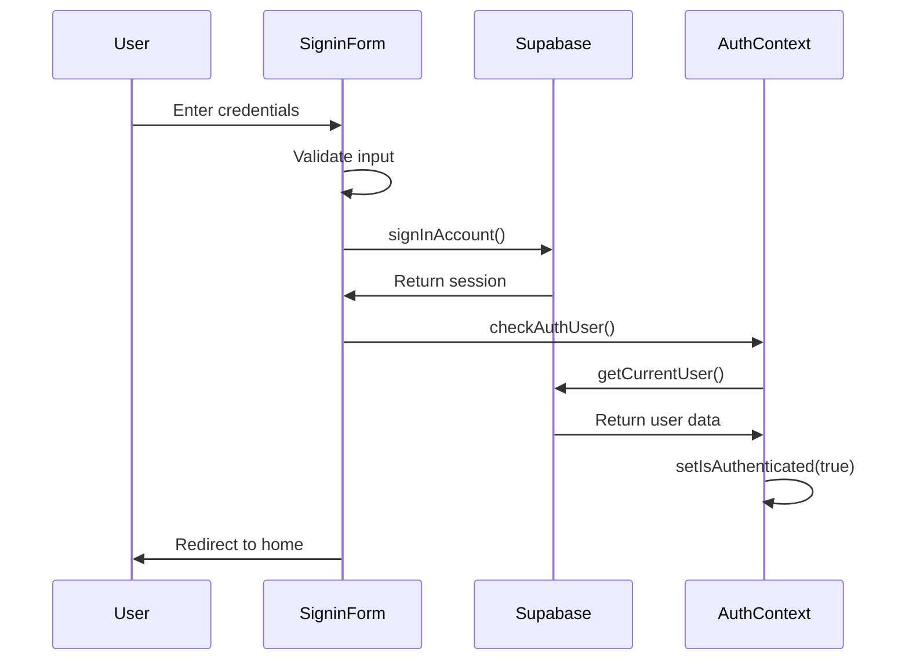
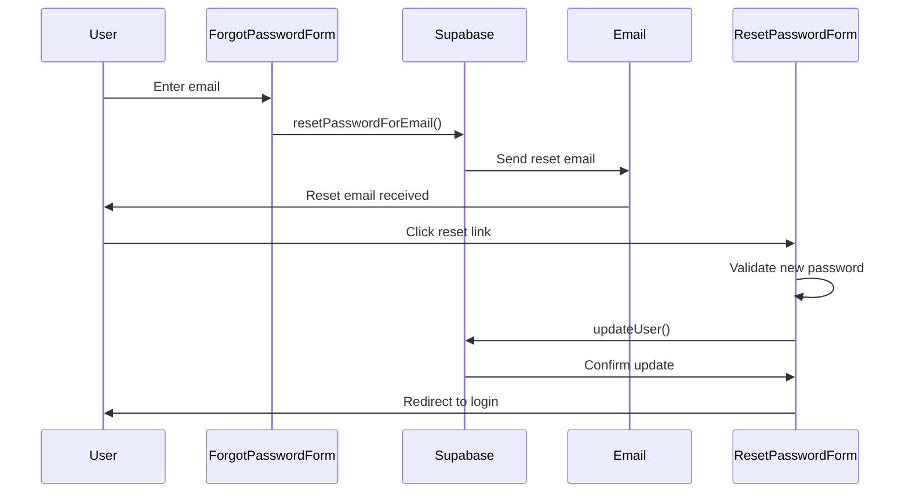

# 🔐 Wita Authentication System

<div align="center">


[🏠 Back to Frontend](../README.md) | [🔧 Setup](#-setup) | [🛡️ Security](#%EF%B8%8F-security) | [📱 Components](#-components)

</div>

---

## 📋 Table of Contents

- [🌟 Overview](#-overview)
- [🏗️ Architecture](#%EF%B8%8F-architecture)
- [🔧 Setup](#-setup)
- [📱 Components](#-components)
- [🛡️ Security Features](#%EF%B8%8F-security-features)
- [🔄 Authentication Flow](#-authentication-flow)
- [🎨 UI Components](#-ui-components)
- [🧪 Testing](#-testing)

---

## 🌟 Overview

The Wita Authentication System provides secure user registration, login, and session management using **Supabase Auth** with React Context for state management. It features comprehensive form validation, password recovery, and seamless integration with the marine platform's social and professional features.

### Key Features
- **🔐 Secure Authentication**: Supabase-powered auth with JWT tokens
- **📝 User Registration**: Complete signup flow with profile creation
- **🔑 Password Recovery**: Email-based password reset functionality
- **🛡️ Protected Routes**: Route-level access control
- **📱 Responsive Design**: Mobile-first authentication UI
- **✅ Form Validation**: Comprehensive input validation with Zod
- **🔄 Session Management**: Automatic token refresh and logout

---

## 🏗️ Architecture

```
src/_auth/
├── AuthLayout.tsx             # Authentication page layout
├── forms/                     # Authentication forms
│   ├── SigninForm.tsx         # User login form
│   ├── SignupForm.tsx         # User registration form
│   ├── ForgotPasswordForm.tsx # Password reset request
│   └── ResetPasswordForm.tsx  # Password reset completion
└── README.md                  # This documentation
```

### Authentication Flow Architecture

```
┌─────────────────┐    ┌─────────────────┐    ┌─────────────────┐
│   User Action   │    │   Auth Context  │    │   Supabase      │
│   Login/Signup  │────│   State Mgmt    │────│   Auth Service  │
│   Forms         │    │   JWT Tokens    │    │   Database      │
└─────────────────┘    └─────────────────┘    └─────────────────┘
         │                       │                       │
         ▼                       ▼                       ▼
┌─────────────────┐    ┌─────────────────┐    ┌─────────────────┐
│   Form          │    │   Protected     │    │   User Profile  │
│   Validation    │    │   Routes        │    │   Creation      │
│   Zod Schemas   │    │   Route Guards  │    │   Database      │
└─────────────────┘    └─────────────────┘    └─────────────────┘
```

---

## 🔧 Setup

### Dependencies
The authentication system relies on these packages (already included in main package.json):

```json
{
  "@supabase/supabase-js": "^2.50.0",
  "react-hook-form": "^7.47.0",
  "@hookform/resolvers": "^3.3.1",
  "zod": "^3.22.4",
  "react-router-dom": "^6.30.1"
}
```

### Environment Configuration
Ensure these environment variables are set in `.env.local`:

```env
VITE_SUPABASE_URL=your_supabase_project_url
VITE_SUPABASE_ANON_KEY=your_supabase_anon_key
```

### Supabase Setup

#### 1. Database Schema
```sql
-- Users table (auto-created by Supabase Auth)
-- Additional user profile data
CREATE TABLE profiles (
  id UUID REFERENCES auth.users(id) ON DELETE CASCADE PRIMARY KEY,
  name TEXT,
  username TEXT UNIQUE,
  email TEXT,
  image_url TEXT,
  bio TEXT,
  created_at TIMESTAMP WITH TIME ZONE DEFAULT NOW(),
  updated_at TIMESTAMP WITH TIME ZONE DEFAULT NOW()
);

-- Row Level Security
ALTER TABLE profiles ENABLE ROW LEVEL SECURITY;

-- Policies
CREATE POLICY "Users can view their own profile" ON profiles
  FOR SELECT USING (auth.uid() = id);

CREATE POLICY "Users can update their own profile" ON profiles
  FOR UPDATE USING (auth.uid() = id);

CREATE POLICY "Users can insert their own profile" ON profiles
  FOR INSERT WITH CHECK (auth.uid() = id);
```

#### 2. Auth Configuration
In Supabase Dashboard → Authentication → Settings:

```json
{
  "site_url": "http://localhost:5173",
  "redirect_urls": [
    "http://localhost:5173",
    "http://localhost:5173/reset-password"
  ],
  "email_confirm": true,
  "enable_signup": true,
  "password_min_length": 8
}
```

---

## 📱 Components

### AuthLayout.tsx
Main layout wrapper for authentication pages.

```tsx
const AuthLayout = () => {
  const { isAuthenticated } = useUserContext();

  return (
    <>
      {isAuthenticated ? (
        <Navigate to="/" />
      ) : (
        <section className="flex flex-1 justify-center items-center flex-col py-10">
          <Outlet />
        </section>
      )}
    </>
  );
};
```

**Features**:
- Automatic redirect for authenticated users
- Responsive layout for auth forms
- Integration with AuthContext

### SigninForm.tsx
User login form with email/password authentication.

```tsx
const SigninForm = () => {
  const form = useForm<z.infer<typeof SigninValidation>>({
    resolver: zodResolver(SigninValidation),
    defaultValues: {
      email: "",
      password: "",
    },
  });

  const handleSignin = async (user: z.infer<typeof SigninValidation>) => {
    const session = await signInAccount(user);
    if (session) {
      const isLoggedIn = await checkAuthUser();
      if (isLoggedIn) {
        navigate("/");
      }
    }
  };
};
```

**Features**:
- Email/password validation
- Error handling and user feedback
- Remember me functionality (planned)
- Social login integration (planned)

### SignupForm.tsx
User registration form with profile creation.

```tsx
const SignupForm = () => {
  const form = useForm<z.infer<typeof SignupValidation>>({
    resolver: zodResolver(SignupValidation),
    defaultValues: {
      name: "",
      username: "",
      email: "",
      password: "",
    },
  });

  const handleSignup = async (user: z.infer<typeof SignupValidation>) => {
    const newUser = await createUserAccount(user);
    if (newUser) {
      const session = await signInAccount({
        email: user.email,
        password: user.password,
      });
    }
  };
};
```

**Features**:
- Complete user registration
- Username uniqueness validation
- Automatic profile creation
- Email verification support

### ForgotPasswordForm.tsx
Password reset request form.

```tsx
const ForgotPasswordForm = () => {
  const handlePasswordReset = async (email: string) => {
    const { error } = await supabase.auth.resetPasswordForEmail(email, {
      redirectTo: `${window.location.origin}/reset-password`,
    });
    
    if (!error) {
      toast({
        title: "Password reset email sent",
        description: "Check your email for reset instructions",
      });
    }
  };
};
```

**Features**:
- Email-based password reset
- Custom redirect URL handling
- User feedback and confirmation

### ResetPasswordForm.tsx
Password reset completion form.

```tsx
const ResetPasswordForm = () => {
  const handlePasswordUpdate = async (newPassword: string) => {
    const { error } = await supabase.auth.updateUser({
      password: newPassword
    });
    
    if (!error) {
      navigate("/sign-in");
    }
  };
};
```

**Features**:
- Secure password update
- Password strength validation
- Automatic redirect after reset

---

## 🛡️ Security Features

### Input Validation with Zod

#### Validation Schemas
```typescript
// lib/validation/index.ts
export const SignupValidation = z.object({
  name: z.string().min(2, { message: "Name must be at least 2 characters." }),
  username: z.string().min(2, { message: "Username must be at least 2 characters." }),
  email: z.string().email({ message: "Invalid email address." }),
  password: z.string().min(8, { message: "Password must be at least 8 characters." }),
});

export const SigninValidation = z.object({
  email: z.string().email({ message: "Invalid email address." }),
  password: z.string().min(1, { message: "Password is required." }),
});

export const PasswordResetValidation = z.object({
  password: z.string()
    .min(8, { message: "Password must be at least 8 characters." })
    .regex(/^(?=.*[a-z])(?=.*[A-Z])(?=.*\d)/, {
      message: "Password must contain uppercase, lowercase, and number."
    }),
  confirmPassword: z.string()
}).refine(data => data.password === data.confirmPassword, {
  message: "Passwords don't match",
  path: ["confirmPassword"],
});
```

### Authentication Context

#### AuthContext.tsx
```typescript
const AuthContext = createContext<IContextType>(INITIAL_STATE);

export function AuthProvider({ children }: { children: React.ReactNode }) {
  const [user, setUser] = useState<IUser>(INITIAL_USER);
  const [isLoading, setIsLoading] = useState(false);
  const [isAuthenticated, setIsAuthenticated] = useState(false);

  const checkAuthUser = async () => {
    setIsLoading(true);
    try {
      const currentUser = await getCurrentUser();
      if (currentUser) {
        setUser({
          id: currentUser.id,
          name: currentUser.name,
          username: currentUser.username,
          email: currentUser.email,
          image_url: currentUser.image_url,
          bio: currentUser.bio,
        });
        setIsAuthenticated(true);
        return true;
      }
      return false;
    } catch (error) {
      console.error(error);
      return false;
    } finally {
      setIsLoading(false);
    }
  };

  useEffect(() => {
    const { data: { subscription } } = supabase.auth.onAuthStateChange(
      async (event, session) => {
        if (event === 'SIGNED_IN' && session) {
          await checkAuthUser();
        } else if (event === 'SIGNED_OUT') {
          setUser(INITIAL_USER);
          setIsAuthenticated(false);
        }
      }
    );

    return () => subscription.unsubscribe();
  }, []);
}
```

### Protected Routes

#### Route Protection
```tsx
// App.tsx
const App = () => {
  return (
    <Routes>
      {/* Public routes */}
      <Route element={<AuthLayout />}>
        <Route path="/sign-in" element={<SigninForm />} />
        <Route path="/sign-up" element={<SignupForm />} />
        <Route path="/forgot-password" element={<ForgotPasswordForm />} />
        <Route path="/reset-password" element={<ResetPasswordForm />} />
      </Route>

      {/* Protected routes */}
      <Route element={<RootLayout />}>
        <Route index element={<Home />} />
        <Route path="/dashboard/*" element={<Dashboard />} />
        {/* ... other protected routes */}
      </Route>
    </Routes>
  );
};
```

### Session Management

#### Automatic Token Refresh
```typescript
// lib/supabase/config.ts
export const supabase = createClient(supabaseUrl, supabaseAnonKey, {
  auth: {
    autoRefreshToken: true,
    persistSession: true,
    detectSessionInUrl: true
  }
});
```

---

## 🔄 Authentication Flow

### 1. User Registration Flow


### 2. User Login Flow


### 3. Password Reset Flow


---

## 🎨 UI Components

### Form Styling
```css
/* globals.css */
.shad-form_label {
  @apply text-white !important;
}

.shad-form_message {
  @apply text-red !important;
}

.shad-input {
  @apply h-12 bg-dark-4 border-none placeholder:text-light-4 focus-visible:ring-1 focus-visible:ring-offset-1 ring-offset-light-3 !important;
}

.shad-button_primary {
  @apply bg-primary-500 hover:bg-primary-500 text-light-1 flex gap-2 !important;
}
```

### Responsive Design
- **Mobile-first**: Optimized for mobile devices
- **Tablet support**: Enhanced layout for tablets
- **Desktop experience**: Full-featured desktop interface
- **Dark theme**: Consistent with marine platform aesthetic

### Error Handling
```typescript
const handleFormError = (error: any) => {
  let message = "An unexpected error occurred";
  
  if (error?.message) {
    message = error.message;
  } else if (error?.error_description) {
    message = error.error_description;
  }
  
  toast({
    title: "Authentication Error",
    description: message,
    variant: "destructive"
  });
};
```

---

## 🧪 Testing

### Manual Testing Checklist

#### Registration Testing
- [ ] Valid email registration
- [ ] Invalid email format handling
- [ ] Password strength validation
- [ ] Username uniqueness check
- [ ] Profile creation success
- [ ] Email verification (if enabled)

#### Login Testing
- [ ] Valid credentials login
- [ ] Invalid credentials handling
- [ ] Password reset functionality
- [ ] Session persistence
- [ ] Automatic logout on token expiry

#### Security Testing
- [ ] SQL injection prevention
- [ ] XSS protection
- [ ] CSRF token validation
- [ ] Rate limiting (if implemented)
- [ ] Password encryption verification

### Automated Testing (Future)
```typescript
// __tests__/auth/SigninForm.test.tsx
describe('SigninForm', () => {
  test('validates required fields', () => {
    // Test form validation
  });
  
  test('handles successful login', () => {
    // Test login flow
  });
  
  test('displays error for invalid credentials', () => {
    // Test error handling
  });
});
```

---

## 🔗 Related Documentation

- **[🎨 Frontend Application](../README.md)** - Main frontend documentation
- **[🏠 Main Project](../../README.md)** - Overall project documentation
- **[🌊 Backend APIs](../Backend/README.md)** - Backend integration
- **[📱 UI Components](../components/ui/README.md)** - UI component library

### External Resources
- **[Supabase Auth Documentation](https://supabase.io/docs/guides/auth)** - Authentication provider
- **[React Hook Form](https://react-hook-form.com/)** - Form management
- **[Zod Documentation](https://zod.dev/)** - Schema validation
- **[React Router](https://reactrouter.com/)** - Routing and navigation

---

<div align="center">

**🔐 Secure authentication for the marine community**

[Report Security Issue](https://github.com/your-repo/security) • [Auth Documentation](https://supabase.io/docs/guides/auth) • [Best Practices](./SECURITY.md)

</div>
