# 🌊 Wita Application Pages

<div align="center">


[🏠 Back to Frontend](../../README.md) | [📱 Social](#-social-pages) | [👥 Users](#-user-pages) | [📊 Content](#-content-pages)

</div>

---

## 📋 Table of Contents

- [🌟 Overview](#-overview)
- [🏗️ Page Architecture](#%EF%B8%8F-page-architecture)
- [📱 Social Pages](#-social-pages)
- [👥 User Pages](#-user-pages)
- [📊 Content Pages](#-content-pages)
- [🔍 Discovery Pages](#-discovery-pages)
- [⚙️ Management Pages](#%EF%B8%8F-management-pages)
- [🚀 Performance](#-performance)
- [🧭 Navigation](#-navigation)

---

## 🌟 Overview

The Wita Application Pages constitute the main user interface of the marine social platform. Built with **React**, **TypeScript**, and **React Query**, these pages provide comprehensive functionality for social networking, content creation, user discovery, and marine community engagement.

### Key Features
- **🌊 Social Networking**: Posts, interactions, and community features
- **👥 User Management**: Profiles, discovery, and connections
- **📱 Content Creation**: Rich media posts and stories
- **🔍 Discovery**: Explore content and find users
- **📊 Analytics**: User engagement and content insights
- **⚡ Performance**: Optimized loading and caching
- **📱 Responsive**: Mobile-first design approach

---

## 🏗️ Page Architecture

```
src/_root/pages/
├── Home.tsx                   # Main social feed
├── Explore.tsx                # Content discovery
├── AllUsers.tsx               # User directory
├── Saved.tsx                  # Saved content
├── LikedPosts.tsx             # Liked content
├── CreatePost.tsx             # Post creation
├── EditPost.tsx               # Post editing
├── PostDetails.tsx            # Individual post view
├── Profile.tsx                # User profile page
├── UpdateProfile.tsx          # Profile editing
└── index.ts                   # Barrel exports
```

### Page Flow Architecture

```mermaid
graph TD
    A[🏠 Home Feed] --> B[📱 Create Post]
    A --> C[🔍 Explore]
    A --> D[👤 Profile]
    
    B --> E[📝 Post Form]
    E --> A
    
    C --> F[🌟 Trending]
    C --> G[👥 Users]
    
    D --> H[✏️ Edit Profile]
    D --> I[💾 Saved Posts]
    D --> J[❤️ Liked Posts]
    
    A --> K[📄 Post Details]
    K --> L[✏️ Edit Post]
```



### Data Flow Pattern
```
Page Component
    ├── React Query Hooks
    │   ├── Data Fetching
    │   ├── Mutations
    │   └── Cache Management
    ├── State Management
    │   ├── Local State
    │   ├── Form State
    │   └── UI State
    └── UI Components
        ├── Shared Components
        ├── Page-specific Components
        └── Loading/Error States
```

---

## 📱 Social Pages

### Home.tsx
Main social media feed with infinite scroll.

```tsx
const Home = () => {
  const {
    data: posts,
    isLoading: isPostLoading,
    isError: isErrorPosts,
    fetchNextPage,
    hasNextPage,
  } = useGetRecentPosts();

  const { data: creators, isLoading: isUserLoading } = useGetUsers(10);

  if (isErrorPosts) {
    return (
      <div className="flex flex-1">
        <div className="home-container">
          <p className="body-medium text-light-1">Something bad happened</p>
        </div>
        <div className="home-creators">
          <p className="body-medium text-light-1">Something bad happened</p>
        </div>
      </div>
    );
  }

  return (
    <div className="flex flex-1">
      <div className="home-container">
        <div className="home-posts">
          <h2 className="h3-bold md:h2-bold text-left w-full">Home Feed</h2>
          {isPostLoading && !posts ? (
            <Loader />
          ) : (
            <ul className="flex flex-col flex-1 gap-9 w-full ">
              {posts?.pages.map((item, index) => (
                <li key={`page-${index}`} className="flex flex-col flex-1 gap-9 w-full">
                  {item?.documents.map((post: Models.Document) => (
                    <div key={post.$id} className="flex flex-col flex-1 gap-9 w-full">
                      <PostCard post={post} />
                    </div>
                  ))}
                </li>
              ))}
            </ul>
          )}
        </div>

        {hasNextPage && !isPostLoading && (
          <div ref={ref} className="mt-10">
            <Loader />
          </div>
        )}
      </div>

      <div className="home-creators">
        <h3 className="h3-bold text-light-1">Top Creators</h3>
        {isUserLoading && !creators ? (
          <Loader />
        ) : (
          <ul className="grid 2xl:grid-cols-2 gap-6">
            {creators?.documents.map((creator) => (
              <li key={creator?.$id}>
                <UserCard user={creator} />
              </li>
            ))}
          </ul>
        )}
      </div>
    </div>
  );
};
```

**Features**:
- **📜 Infinite Scroll**: Continuous feed loading
- **👥 Creator Sidebar**: Top community members
- **🔄 Real-time Updates**: Live content refresh
- **📱 Responsive Layout**: Mobile and desktop optimized
- **⚡ Performance**: Virtualized scrolling for large feeds
- **🎯 Personalization**: Algorithm-based content ranking

### CreatePost.tsx
Content creation page with rich media support.

```tsx
const CreatePost = () => {
  return (
    <div className="flex flex-1">
      <div className="common-container">
        <div className="flex-start gap-3 justify-start w-full max-w-5xl">
          
          <h2 className="h3-bold md:h2-bold text-left w-full">Create Post</h2>
        </div>

        <PostForm action="Create" />
      </div>
    </div>
  );
};
```

**Features**:
- **📸 Media Upload**: Image and video support
- **🏷️ Tag System**: Hashtag and location tagging
- **✏️ Rich Text**: Caption editing with formatting
- **👁️ Preview**: Real-time post preview
- **💾 Draft Saving**: Auto-save functionality
- **🎨 Filters**: Image enhancement tools

### PostDetails.tsx
Individual post view with comments and interactions.

```tsx
const PostDetails = () => {
  const { id } = useParams();
  const { user } = useUserContext();
  const navigate = useNavigate();

  const { data: post, isLoading } = useGetPostById(id);
  const { data: userPosts, isLoading: isUserPostLoading } = useGetUserPosts(
    post?.creator.$id
  );

  const relatedPosts = userPosts?.documents.filter(
    (userPost) => userPost.$id !== id
  );

  if (isLoading)
    return (
      <div className="flex-center w-full h-full">
        <Loader />
      </div>
    );

  return (
    <div className="post_details-container">
      <div className="hidden md:flex max-w-5xl w-full">
        <Button
          onClick={() => navigate(-1)}
          variant="ghost"
          className="shad-button_ghost"
        >
          
          <p className="small-medium lg:base-medium">Back</p>
        </Button>
      </div>

      {post && (
        <div className="post_details-card">
          

          <div className="post_details-info">
            <div className="flex-between w-full">
              <Link
                to={`/profile/${post?.creator.$id}`}
                className="flex items-center gap-3"
              >
                
                <div className="flex gap-1 flex-col">
                  <p className="base-medium lg:body-bold text-light-1">
                    {post?.creator.name}
                  </p>
                  <div className="flex-center gap-2 text-light-3">
                    <p className="subtle-semibold lg:small-regular ">
                      {multiFormatDateString(post?.$createdAt)}
                    </p>
                    •
                    <p className="subtle-semibold lg:small-regular">
                      {post?.location}
                    </p>
                  </div>
                </div>
              </Link>

              <div className="flex-center gap-4">
                <Link
                  to={`/update-post/${post?.$id}`}
                  className={`${user.id !== post?.creator.$id && "hidden"}`}
                >
                  
                </Link>

                <Button
                  onClick={handleDeletePost}
                  variant="ghost"
                  className={`ost_details-delete_btn ${
                    user.id !== post?.creator.$id && "hidden"
                  }`}
                >
                  
                </Button>
              </div>
            </div>

            <hr className="border w-full border-dark-4/80" />

            <div className="flex flex-col flex-1 w-full small-medium lg:base-regular">
              <p>{post?.caption}</p>
              <ul className="flex gap-1 mt-2">
                {post?.tags.map((tag: string, index: string) => (
                  <li key={`${tag}${index}`} className="text-light-3 small-regular">
                    #{tag}
                  </li>
                ))}
              </ul>
            </div>

            <div className="w-full">
              <PostStats post={post} userId={user.id} />
            </div>
          </div>
        </div>
      )}

      <div className="w-full max-w-5xl">
        <hr className="border w-full border-dark-4/80" />

        <h3 className="body-bold md:h3-bold w-full my-10">
          More Related Posts
        </h3>
        {isUserPostLoading || !relatedPosts ? (
          <Loader />
        ) : (
          <GridPostList posts={relatedPosts} showUser={false} />
        )}
      </div>
    </div>
  );
};
```

**Features**:
- **🖼️ Full Image View**: High-resolution image display
- **📊 Interaction Stats**: Detailed engagement metrics
- **💬 Comments System**: Threaded comment discussions
- **🔗 Related Content**: Similar posts recommendation
- **🗑️ Post Management**: Edit/delete for owners
- **📱 Responsive Design**: Mobile-optimized layout

---

## 👥 User Pages

### Profile.tsx
Comprehensive user profile with content grid.

```tsx
const Profile = () => {
  const { id } = useParams();
  const { user } = useUserContext();
  
  const { data: currentUser } = useGetUserById(id || "");

  if (!currentUser)
    return (
      <div className="flex-center w-full h-full">
        <Loader />
      </div>
    );

  return (
    <div className="profile-container">
      <div className="profile-inner_container">
        <div className="flex xl:flex-row flex-col max-xl:items-center flex-1 gap-7">
          
          <div className="flex flex-col flex-1 justify-between md:mt-2">
            <div className="flex flex-col w-full">
              <h1 className="text-center xl:text-left h3-bold md:h1-semibold w-full">
                {currentUser.name}
              </h1>
              <p className="small-regular md:body-medium text-light-3 text-center xl:text-left">
                @{currentUser.username}
              </p>
            </div>

            <div className="flex gap-8 mt-10 items-center justify-center xl:justify-start flex-wrap z-20">
              <StatBlock value={currentUser.posts.length} label="Posts" />
              <StatBlock value={20} label="Followers" />
              <StatBlock value={20} label="Following" />
            </div>

            <p className="small-medium md:base-medium text-center xl:text-left mt-7 max-w-screen-sm">
              {currentUser.bio}
            </p>
          </div>

          <div className="flex justify-center gap-4">
            <div className={`${user.id !== currentUser.$id && "hidden"}`}>
              <Link
                to={`/update-profile/${currentUser.$id}`}
                className={`h-12 bg-dark-4 px-5 text-light-1 flex-center gap-2 rounded-lg ${
                  user.id !== currentUser.$id && "hidden"
                }`}
              >
                
                <p className="flex whitespace-nowrap small-medium">
                  Edit Profile
                </p>
              </Link>
            </div>
            <div className={`${user.id === id && "hidden"}`}>
              <Button type="button" className="shad-button_primary px-8">
                Follow
              </Button>
            </div>
          </div>
        </div>
      </div>

      {currentUser.$id === user.id && (
        <div className="flex max-w-5xl w-full">
          <Link
            to={`/profile/${id}/posts`}
            className={`profile-tab rounded-l-lg ${
              pathname === `/profile/${id}` && "!bg-dark-3"
            }`}
          >
            
            Posts
          </Link>
          <Link
            to={`/profile/${id}/liked-posts`}
            className={`profile-tab rounded-r-lg ${
              pathname === `/profile/${id}/liked-posts` && "!bg-dark-3"
            }`}
          >
            
            Liked Posts
          </Link>
        </div>
      )}

      <Routes>
        <Route
          index
          element={<GridPostList posts={currentUser.posts} showUser={false} />}
        />
        {currentUser.$id === user.id && (
          <Route path="/liked-posts" element={<LikedPosts />} />
        )}
      </Routes>
    </div>
  );
};
```

**Features**:
- **👤 Profile Information**: Complete user details
- **📊 Statistics**: Post count, followers, following
- **🖼️ Content Grid**: User's posts in grid layout
- **⚙️ Profile Management**: Edit profile for owners
- **👥 Social Actions**: Follow/unfollow functionality
- **📱 Tab Navigation**: Posts and liked posts sections

### AllUsers.tsx
User directory with search and filtering.

```tsx
const AllUsers = () => {
  const { data: creators, isLoading, isError: isErrorCreators } = useGetUsers();

  if (isErrorCreators) {
    return (
      <div className="flex flex-1">
        <div className="user-container">
          <p className="body-medium text-light-1">Something bad happened</p>
        </div>
      </div>
    );
  }

  return (
    <div className="common-container">
      <div className="user-container">
        <h2 className="h3-bold md:h2-bold text-left w-full">All Users</h2>
        {isLoading && !creators ? (
          <Loader />
        ) : (
          <ul className="user-grid">
            {creators?.documents.map((creator) => (
              <li key={creator?.$id} className="flex-1 min-w-[200px] w-full  ">
                <UserCard user={creator} />
              </li>
            ))}
          </ul>
        )}
      </div>
    </div>
  );
};
```

**Features**:
- **👥 User Directory**: Complete user listing
- **🔍 Search Functionality**: Find users by name/username
- **🏷️ Category Filters**: Filter by interests/profession
- **📊 User Stats**: Basic user information cards
- **📱 Responsive Grid**: Adaptive layout for all devices
- **⚡ Infinite Scroll**: Performance-optimized loading

### UpdateProfile.tsx
Profile editing with image upload.

```tsx
const UpdateProfile = () => {
  const navigate = useNavigate();
  const { id } = useParams();
  const { user, setUser } = useUserContext();
  const form = useForm<z.infer<typeof ProfileValidation>>({
    resolver: zodResolver(ProfileValidation),
    defaultValues: {
      file: [],
      name: user.name,
      username: user.username,
      email: user.email,
      bio: user.bio || "",
    },
  });

  // Queries
  const { data: currentUser } = useGetUserById(id || "");
  const { mutateAsync: updateUser, isLoading: isLoadingUpdate } =
    useUpdateUser();

  if (!currentUser)
    return (
      <div className="flex-center w-full h-full">
        <Loader />
      </div>
    );

  // Handler
  const handleUpdate = async (value: z.infer<typeof ProfileValidation>) => {
    const updatedUser = await updateUser({
      userId: currentUser.$id,
      name: value.name,
      bio: value.bio,
      file: value.file,
      imageUrl: currentUser.imageUrl,
      imageId: currentUser.imageId,
    });

    if (!updatedUser) {
      toast({
        title: `Update user failed. Please try again.`,
      });
      
      return;
    }

    setUser({
      ...user,
      name: updatedUser?.name,
      bio: updatedUser?.bio,
      imageUrl: updatedUser?.imageUrl,
    });
    return navigate(`/profile/${id}`);
  };

  return (
    <div className="flex flex-1">
      <div className="common-container">
        <div className="flex-start gap-3 justify-start w-full max-w-5xl">
          
          <h2 className="h3-bold md:h2-bold text-left w-full">Edit Profile</h2>
        </div>

        <Form {...form}>
          <form
            onSubmit={form.handleSubmit(handleUpdate)}
            className="flex flex-col gap-7 w-full mt-4 max-w-5xl"
          >
            <FormField
              control={form.control}
              name="file"
              render={({ field }) => (
                <FormItem className="flex">
                  <FormControl>
                    <ProfileUploader
                      fieldChange={field.onChange}
                      mediaUrl={currentUser.imageUrl}
                    />
                  </FormControl>
                  <FormMessage className="shad-form_message" />
                </FormItem>
              )}
            />

            <FormField
              control={form.control}
              name="name"
              render={({ field }) => (
                <FormItem>
                  <FormLabel className="shad-form_label">Name</FormLabel>
                  <FormControl>
                    <Input type="text" className="shad-input" {...field} />
                  </FormControl>
                  <FormMessage />
                </FormItem>
              )}
            />

            <FormField
              control={form.control}
              name="username"
              render={({ field }) => (
                <FormItem>
                  <FormLabel className="shad-form_label">Username</FormLabel>
                  <FormControl>
                    <Input
                      type="text"
                      className="shad-input"
                      {...field}
                      disabled
                    />
                  </FormControl>
                  <FormMessage />
                </FormItem>
              )}
            />

            <FormField
              control={form.control}
              name="email"
              render={({ field }) => (
                <FormItem>
                  <FormLabel className="shad-form_label">Email</FormLabel>
                  <FormControl>
                    <Input
                      type="text"
                      className="shad-input"
                      {...field}
                      disabled
                    />
                  </FormControl>
                  <FormMessage />
                </FormItem>
              )}
            />

            <FormField
              control={form.control}
              name="bio"
              render={({ field }) => (
                <FormItem>
                  <FormLabel className="shad-form_label">Bio</FormLabel>
                  <FormControl>
                    <Textarea
                      className="shad-textarea custom-scrollbar"
                      {...field}
                    />
                  </FormControl>
                  <FormMessage className="shad-form_message" />
                </FormItem>
              )}
            />

            <div className="flex gap-4 items-center justify-end">
              <Button
                type="button"
                className="shad-button_dark_4"
                onClick={() => navigate(-1)}
              >
                Cancel
              </Button>
              <Button
                type="submit"
                className="shad-button_primary whitespace-nowrap"
                disabled={isLoadingUpdate}
              >
                {isLoadingUpdate && <Loader />}
                Update Profile
              </Button>
            </div>
          </form>
        </Form>
      </div>
    </div>
  );
};
```

**Features**:
- **📸 Profile Picture**: Image upload and cropping
- **📝 Form Validation**: Comprehensive input validation
- **⚡ Real-time Preview**: Live profile preview
- **💾 Auto-save**: Draft saving functionality
- **🔄 State Management**: Context integration
- **📱 Responsive Design**: Mobile-optimized editing

---

## 📊 Content Pages

### Saved.tsx
User's saved content collection.

```tsx
const Saved = () => {
  const { data: posts, isLoading: isPostLoading } = useGetCurrentUser();

  const savePosts = posts?.save
    .map((savePost: Models.Document) => ({
      ...savePost.post,
      creator: {
        imageUrl: savePost.post.creator.imageUrl,
      },
    }))
    .reverse();

  return (
    <div className="saved-container">
      <div className="flex gap-2 w-full max-w-5xl">
        
        <h2 className="h3-bold md:h2-bold text-left w-full">Saved Posts</h2>
      </div>

      {!isPostLoading && (!posts || savePosts.length === 0) ? (
        <p className="text-light-4">No available posts</p>
      ) : (
        <ul className="w-full flex justify-center max-w-5xl gap-9">
          {isPostLoading && !posts ? (
            <Loader />
          ) : (
            <GridPostList posts={savePosts} showStats={false} />
          )}
        </ul>
      )}
    </div>
  );
};
```

**Features**:
- **💾 Saved Content**: User's bookmarked posts
- **🔍 Quick Access**: Easy content retrieval
- **📊 Grid Layout**: Visual content organization
- **🏷️ Category Filtering**: Filter saved content
- **📱 Mobile Optimized**: Touch-friendly interface
- **⚡ Fast Loading**: Optimized content rendering

### LikedPosts.tsx
User's liked content history.

```tsx
const LikedPosts = () => {
  const { data: posts, isLoading: isPostLoading } = useGetCurrentUser();

  const likedPosts = posts?.liked
    .map((likePost: Models.Document) => ({
      ...likePost.post,
      creator: {
        imageUrl: likePost.post.creator.imageUrl,
      },
    }))
    .reverse();

  return (
    <>
      {!isPostLoading && (!posts || likedPosts.length === 0) ? (
        <p className="text-light-4">No liked posts</p>
      ) : (
        <ul className="w-full flex justify-center max-w-5xl gap-9">
          {isPostLoading && !posts ? (
            <Loader />
          ) : (
            <GridPostList posts={likedPosts} showStats={false} />
          )}
        </ul>
      )}
    </>
  );
};
```

**Features**:
- **❤️ Liked Content**: User's interaction history
- **📈 Engagement Tracking**: Personal analytics
- **🔄 Real-time Updates**: Live like status
- **📊 Visual History**: Grid-based content view
- **🎯 Personalization**: Tailored content recommendations
- **📱 Mobile Experience**: Optimized touch interactions

---

## 🔍 Discovery Pages

### Explore.tsx
Content discovery with trending and recommendations.

```tsx
const Explore = () => {
  const { data: posts, fetchNextPage, hasNextPage } = useGetPosts();
  const [searchValue, setSearchValue] = useState("");
  const debouncedSearch = useDebounce(searchValue, 500);
  const { data: searchedPosts, isFetching: isSearchFetching } = useSearchPosts(debouncedSearch);

  useEffect(() => {
    const delayedFetch = setTimeout(() => {
      if (searchValue === "") {
        setSearchValue("");
      }
    }, 500);

    return () => clearTimeout(delayedFetch);
  }, [searchValue]);

  if (!posts)
    return (
      <div className="flex-center w-full h-full">
        <Loader />
      </div>
    );

  const shouldShowSearchResults = searchValue !== "";
  const shouldShowPosts = !shouldShowSearchResults && 
    posts.pages.every((item) => item.documents.length === 0);

  return (
    <div className="explore-container">
      <div className="explore-inner_container">
        <h2 className="h3-bold md:h2-bold w-full">Search Posts</h2>
        <div className="flex gap-1 px-4 w-full rounded-lg bg-dark-4">
          
          <Input
            type="text"
            placeholder="Search"
            className="explore-search"
            value={searchValue}
            onChange={(e) => {
              const { value } = e.target;
              setSearchValue(value);
            }}
          />
        </div>
      </div>

      <div className="flex-between w-full max-w-5xl mt-16 mb-7">
        <h3 className="body-bold md:h3-bold">Popular Today</h3>

        <div className="flex-center gap-3 bg-dark-3 rounded-xl px-4 py-2 cursor-pointer">
          <p className="small-medium md:base-medium text-light-2">All</p>
          
        </div>
      </div>

      <div className="flex flex-wrap gap-9 w-full max-w-5xl">
        {shouldShowSearchResults ? (
          <SearchResults
            isSearchFetching={isSearchFetching}
            searchedPosts={searchedPosts}
          />
        ) : shouldShowPosts ? (
          <p className="text-light-4 mt-10 text-center w-full">End of posts</p>
        ) : (
          posts.pages.map((item, index) => (
            <GridPostList
              key={`page-${index}`}
              posts={item.documents}
            />
          ))
        )}
      </div>

      {hasNextPage && !searchValue && (
        <div ref={ref} className="mt-10">
          <Loader />
        </div>
      )}
    </div>
  );
};
```

**Features**:
- **🔍 Search Functionality**: Real-time content search
- **📈 Trending Content**: Popular posts discovery
- **🎯 Personalized Recommendations**: AI-powered suggestions
- **🏷️ Category Filters**: Content type filtering
- **📱 Infinite Scroll**: Continuous content loading
- **⚡ Debounced Search**: Optimized search performance

---

## ⚙️ Management Pages

### EditPost.tsx
Post editing with preservation of original data.

```tsx
const EditPost = () => {
  const navigate = useNavigate();
  const { id } = useParams();
  const { data: post, isLoading } = useGetPostById(id);

  if (isLoading)
    return (
      <div className="flex-center w-full h-full">
        <Loader />
      </div>
    );

  return (
    <div className="flex flex-1">
      <div className="common-container">
        <div className="flex-start gap-3 justify-start w-full max-w-5xl">
          
          <h2 className="h3-bold md:h2-bold text-left w-full">Edit Post</h2>
        </div>

        {isLoading ? <Loader /> : <PostForm action="Update" post={post} />}
      </div>
    </div>
  );
};
```

**Features**:
- **✏️ Content Editing**: Full post modification
- **🔄 Version Control**: Change tracking
- **💾 Auto-save**: Draft preservation
- **🎨 Media Management**: Image/video editing
- **🏷️ Tag Management**: Hashtag editing
- **📊 Preview Mode**: Live preview during editing

---

## 🚀 Performance

### Lazy Loading Implementation
```tsx
// Lazy load heavy components
const LazyPostDetails = lazy(() => import('./PostDetails'));
const LazyProfile = lazy(() => import('./Profile'));

// Wrap with Suspense
<Suspense fallback={<Loader />}>
  <LazyPostDetails />
</Suspense>
```

### React Query Optimization
```tsx
// Prefetch critical data
const prefetchUserData = () => {
  queryClient.prefetchQuery({
    queryKey: ['user', userId],
    queryFn: () => getUserById(userId),
    staleTime: 5 * 60 * 1000, // 5 minutes
  });
};

// Background updates
const { data: posts } = useGetRecentPosts({
  staleTime: 1 * 60 * 1000, // 1 minute
  refetchOnWindowFocus: false,
  refetchInterval: 5 * 60 * 1000, // 5 minutes
});
```

### Bundle Optimization
```javascript
// Webpack code splitting
const pageRoutes = {
  home: () => import('./Home'),
  explore: () => import('./Explore'),
  profile: () => import('./Profile'),
  // ... other routes
};

// Route-based code splitting
const routes = Object.entries(pageRoutes).map(([path, component]) => ({
  path,
  component: lazy(component),
}));
```

### Performance Metrics
- **📊 First Contentful Paint**: < 1.2s
- **⚡ Largest Contentful Paint**: < 2.5s
- **🎯 Cumulative Layout Shift**: < 0.1
- **📱 Mobile Performance Score**: > 90
- **💻 Desktop Performance Score**: > 95

---

## 🧭 Navigation

### Route Configuration
```tsx
// App.tsx route structure
const routes = [
  {
    path: "/",
    element: <RootLayout />,
    children: [
      { index: true, element: <Home /> },
      { path: "explore", element: <Explore /> },
      { path: "saved", element: <Saved /> },
      { path: "all-users", element: <AllUsers /> },
      { path: "create-post", element: <CreatePost /> },
      { path: "update-post/:id", element: <EditPost /> },
      { path: "posts/:id", element: <PostDetails /> },
      { path: "profile/:id/*", element: <Profile /> },
      { path: "update-profile/:id", element: <UpdateProfile /> },
    ],
  },
];
```

### Navigation Components Integration
```tsx
// Sidebar navigation links
export const sidebarLinks = [
  {
    imgURL: "/assets/icons/home.svg",
    route: "/",
    label: "Home",
  },
  {
    imgURL: "/assets/icons/wallpaper.svg",
    route: "/explore",
    label: "Explore",
  },
  {
    imgURL: "/assets/icons/people.svg",
    route: "/all-users",
    label: "People",
  },
  {
    imgURL: "/assets/icons/bookmark.svg",
    route: "/saved",
    label: "Saved",
  },
  {
    imgURL: "/assets/icons/gallery-add.svg",
    route: "/create-post",
    label: "Create Post",
  },
];
```

### Breadcrumb System
```tsx
const Breadcrumb = ({ items }: { items: BreadcrumbItem[] }) => {
  return (
    <nav className="flex mb-4">
      <ol className="inline-flex items-center space-x-1 md:space-x-3">
        {items.map((item, index) => (
          <li key={index} className="inline-flex items-center">
            {index > 0 && (
              <svg className="w-6 h-6 text-gray-400" fill="currentColor" viewBox="0 0 20 20">
                <path fillRule="evenodd" d="M7.293 14.707a1 1 0 010-1.414L10.586 10 7.293 6.707a1 1 0 011.414-1.414l4 4a1 1 0 010 1.414l-4 4a1 1 0 01-1.414 0z" clipRule="evenodd"></path>
              </svg>
            )}
            {item.href ? (
              <Link to={item.href} className="text-blue-600 hover:text-blue-800">
                {item.label}
              </Link>
            ) : (
              <span className="text-gray-500">{item.label}</span>
            )}
          </li>
        ))}
      </ol>
    </nav>
  );
};
```

---

## 🔗 Related Documentation

- **[🎨 Frontend Application](../../README.md)** - Main frontend documentation
- **[🧩 Component System](../components/README.md)** - Reusable UI components
- **[🔐 Authentication System](../_auth/README.md)** - User authentication
- **[🏠 Main Project](../../../README.md)** - Overall project documentation

### External Resources
- **[React Router Documentation](https://reactrouter.com/)** - Client-side routing
- **[React Query Documentation](https://tanstack.com/query/latest)** - Data fetching and caching
- **[React Hook Form](https://react-hook-form.com/)** - Form management
- **[TypeScript Handbook](https://www.typescriptlang.org/docs/)** - Type safety

---

<div align="center">

**🌊 Navigating the depths of marine social networking**

[Performance Guide](./performance) • [SEO Optimization](./seo) • [Analytics](./analytics)

</div>
